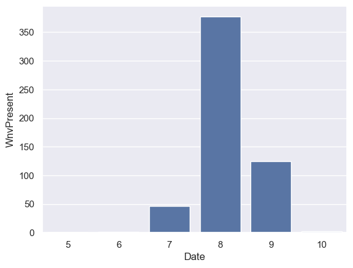
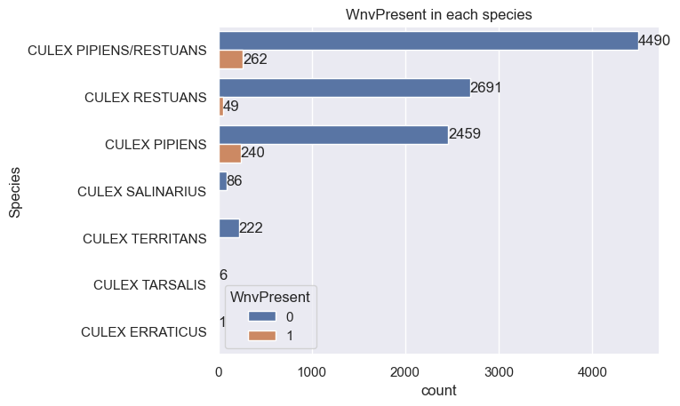

# Project 4: West Nile Virus Disease
## Problem Statement
Better for Life Agency concerns West Nile virus epidemic in Chicago, United State. We are finding volunteers as doctors, nurses, and any medical volunteers who would like to help West Nile Virus patients. But first, we would like to know the data which can inform in this following:
> 1. How possible rate in West Nile Present in Chicago?
> 2. Where is West Nile present? We assume that there are potential patients there.
> 3. When did West Nile present? We can compare date data which date is the highest virus present.

## Data Dictionary
| Data Name | Description | Type | Example |
| --------- | ----------- | ---- | ------- |
| Id | Show ID | String | 123456|
| Date | Show Date | Datetime | 20020-01-01 |
| Address | Approximate Address of the trap location |String | 4100 North Oak |
| Species | Mosquito's Species | String | CULEX |
| Block | Building Block | Integer | 41 |
| Street | Street Name | String | N OAK PARK |
| Trap | Trap Code Number | String | T002 |
| AddressNumberAndStreet | Address and Street | String | 4100 N OAK PARK AVE |
| Latitude | Show Latitude | String | 41.867108 |
| Longitude | Show Longitude | String | -87.654224 |
| count_prev_week_records | Count Virus Present Previous Week | Boolean | 0,1 |
| Wnvpresent | Show West Nile Virus Present | Boolean | 0,1 |

## Exploratory Data Analysis

This bar graph shows that the number of West Nile Virus appeared. There are 3 months have shown which are July, August, and September. August has the highest number of virus which is approximately 350 presents, followed by September.

The bar graph shows the number of mosquito's species which have virus or not. 

## Error Analysis

## Cost Analysis
